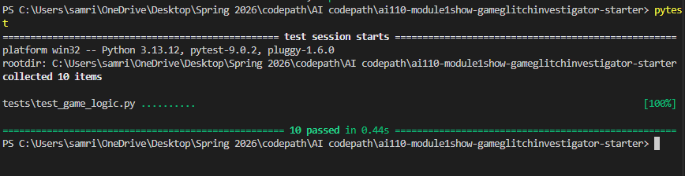
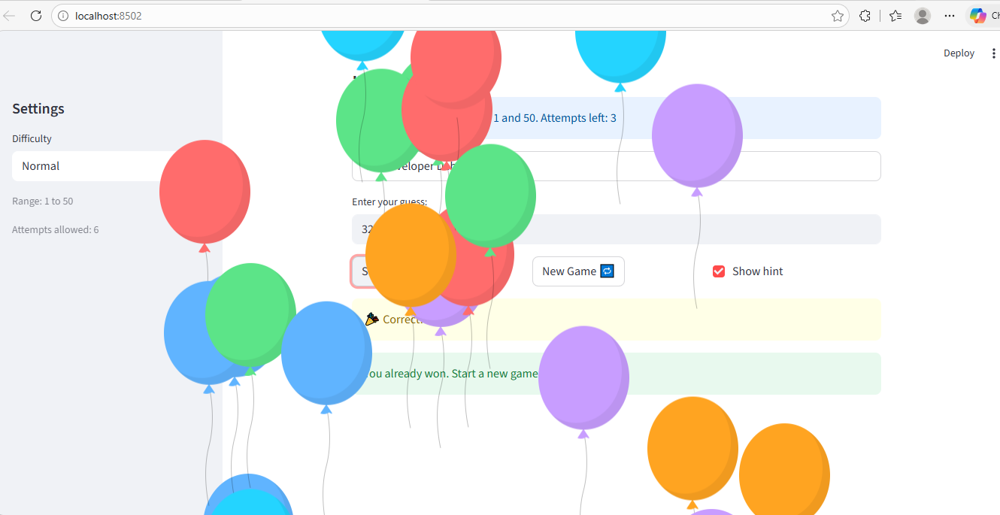

# 🎮 Game Glitch Investigator: The Impossible Guesser

## 🚨 The Situation

You asked an AI to build a simple "Number Guessing Game" using Streamlit.
It wrote the code, ran away, and now the game is unplayable. 

- You can't win.
- The hints lie to you.
- The secret number seems to have commitment issues.

## 🛠️ Setup

1. Install dependencies: `pip install -r requirements.txt`
2. Run the broken app: `python -m streamlit run app.py`

## 🕵️‍♂️ Your Mission

1. **Play the game.** Open the "Developer Debug Info" tab in the app to see the secret number. Try to win.
2. **Find the State Bug.** Why does the secret number change every time you click "Submit"? Ask ChatGPT: *"How do I keep a variable from resetting in Streamlit when I click a button?"*
3. **Fix the Logic.** The hints ("Higher/Lower") are wrong. Fix them.
4. **Refactor & Test.** - Move the logic into `logic_utils.py`.
   - Run `pytest` in your terminal.
   - Keep fixing until all tests pass!

## 📝 Document Your Experience

- [] Describe the game's purpose.

The purpose of the game is to guess a secret number within a certain range based on the selected difficulty level. The player receives hints such as “Go Higher” or “Go Lower” after each guess to help them find the correct number. The game also tracks the number of attempts and calculates a score based on how quickly the player guesses the correct number. 

- [ ] Detail which bugs you found.

Several bugs were present in the original AI-generated code. The hint system sometimes gave the wrong direction, telling the player to go lower even when the secret number was higher than the guess. The game also revealed the secret number before the player had used all their attempts. Another issue was that the New Game button did not properly reset the game, requiring the page to be refreshed manually. Additionally, the attempts counter and guess history did not update immediately after submitting a guess.

- [ ] Explain what fixes you applied.

To fix these issues, I corrected the guess comparison logic so the hints always match whether the guess is too high or too low. I fixed the attempt limit condition so the game only ends when the player actually runs out of attempts. I also added st.rerun() after processing a guess so that the attempts counter and guess history update immediately. Finally, I updated the New Game logic to reset the session state values, including the secret number, attempts, history, and status, so the game restarts correctly.

## 📸 Demo

 

## 🚀 Stretch Features

- [ ] [If you choose to complete Challenge 4, insert a screenshot of your Enhanced Game UI here]
